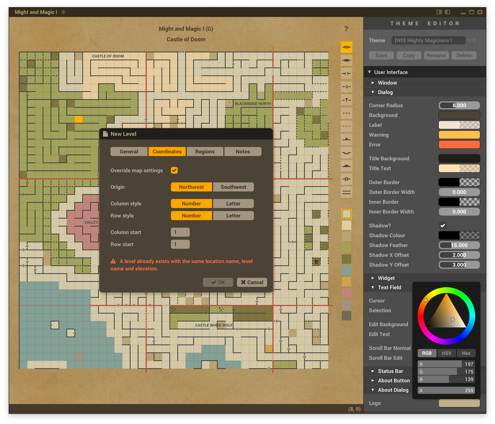

<p align="center"><em>Your trusty old-school cRPG mapping companion</em></p>




## Project website

[https://gridmonger.johnnovak.net](https://gridmonger.johnnovak.net)


## Build instructions

Requires [Nim](https://nim-lang.org/) 2.2.4

### Dependencies

* [koi](https://github.com/johnnovak/koi)
* [nim-osdialog](https://github.com/johnnovak/nim-osdialog)
* [nim-riff](https://github.com/johnnovak/nim-riff)
* [semver](https://github.com/euantorano/semver.nim)
* [winim](https://github.com/khchen/winim) (Windows only)
* [with](https://github.com/zevv/with)

You can install the dependencies with [Nimble](https://github.com/nim-lang/nimble):

```
nimble install koi osdialog riff semver winim with
```

`winim` is only needed for the Windows builds.


### Compiling

The `main` branch is usually in flux as it often contains work-in-progress
changes intended go into the next release. To build the current stable version,
check out the latest tag:

```bash
git tag
# replace with the latest tag
git checkout v1.1.0
```

To build the debug version (debug logging enabled, file dialogs disabled):

```
nim debug
```

To build the release version (file dialogs enabled):

```
nim release
```

Run `nim help` for the full list of build tasks.

> [!IMPORTANT]
> Create an empty directory `Config` in the project root directory to enable
> portable mode, this is what you normally want during development. The
> program will crash if you try to run the compiled executable without
> portable mode enabled!
>
> Read more about portable mode [here](https://gridmonger.johnnovak.net/manual/appendixes/user-data-folder.html).


## Manual & website

The [website](https://gridmonger.johnnovak.net) (GitHub Pages site) and
[manual](https://gridmonger.johnnovak.net/manual/contents.html) are generated
from [Sphinx](https://www.sphinx-doc.org) sources.

The website is published from the [docs](docs) directory of the `master` branch.

### Requirements

- [Sphinx](https://www.sphinx-doc.org/en/master/usage/installation.html) 7.2+
- [Sass](https://sass-lang.com/) 1.57+
- [Make](https://www.gnu.org/software/make/) 3.8+
- [GNU sed](https://www.gnu.org/software/sed/) 4.9+
- Zip 3.0+


### Building

- To build the website, run `nim site`
- To build the manual, run `nim manual`
- To create the zipped distribution package of the manual from the generated
  files, run `nim packageManual`
- Check out the [release build instructions](https://github.com/johnnovak/gridmonger/blob/master/RELEASE.md#build-instructions) for further details.

### Theme development

You can run `make watch_docs_css` or `make watch_frontpage_css` from the
`sphinx-doc` directory to regenerate the CSS when the SASS files are changed
during theme development.


## Packaging & release process

See [RELEASE.md](/RELEASE.md).


## Credits

The user interface uses the [Roboto](https://fonts.google.com/specimen/Roboto)
font by Google for all text (Regular, Bold, and Black variants).

The Gridmonger logo uses [Versal Gothic](https://www.dafont.com/versal.font)
by [Juan Casco](https://juancascofonts.blogspot.com/).

The TTF icon font was created with the amazing [IcoMoon App](https://icomoon.io/).
Most icons are from the below sources available through the app, some are my
own creations, then a few were converted from random free SVG clipart I found
online.

- **IcoMoon - Free** (GPL / CC BY 4.0) — http://keyamoon.com/
- **Font Awesome** (CC BY 4.0) — https://fontawesome.com/
- **Zondicons** (CC BY 4.0) — http://www.zondicons.com/
- **Brankic 1979** (Freeware) —  https://www.brankic1979.com/iconss/ 
- **Material Icons** (Apache License 2.0) — https://fonts.google.com/icons


## License

Developed by John Novak <<john@johnnovak.net>>, 2020-2024

This work is free. You can redistribute it and/or modify it under the terms of
the [Do What The Fuck You Want To Public License, Version
2](http://www.wtfpl.net), as published by Sam Hocevar. See the
[COPYING](./COPYING) file for more details.

